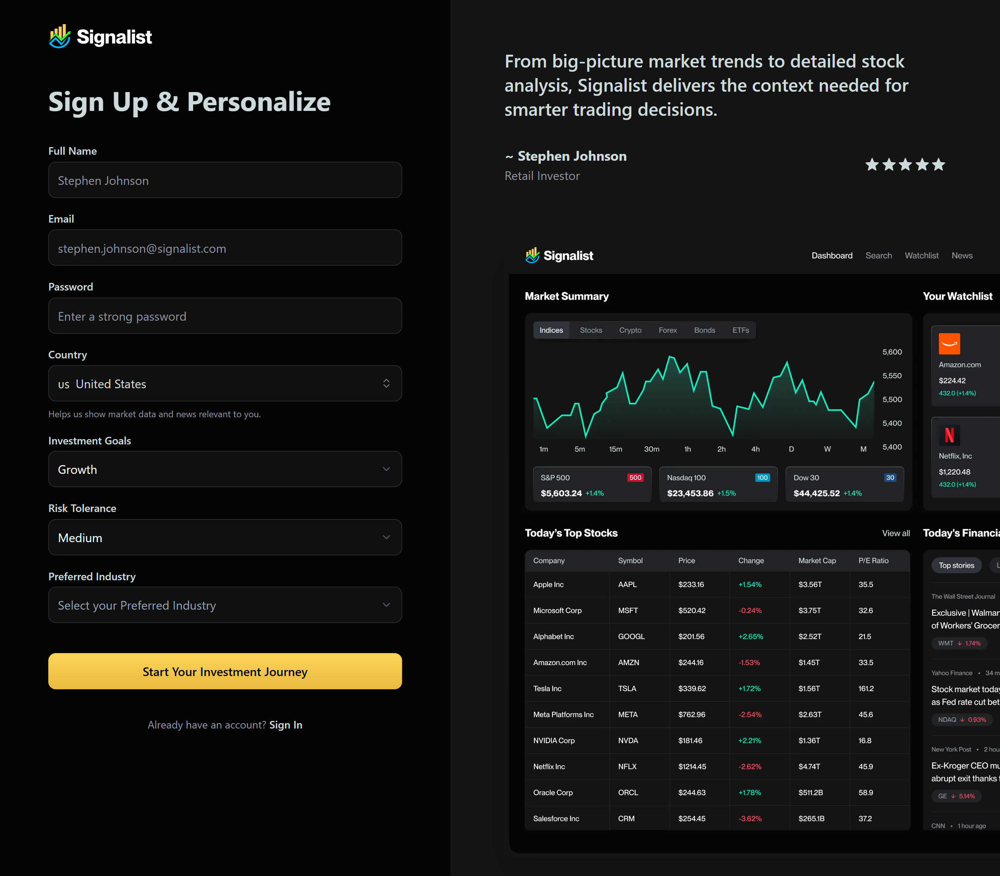
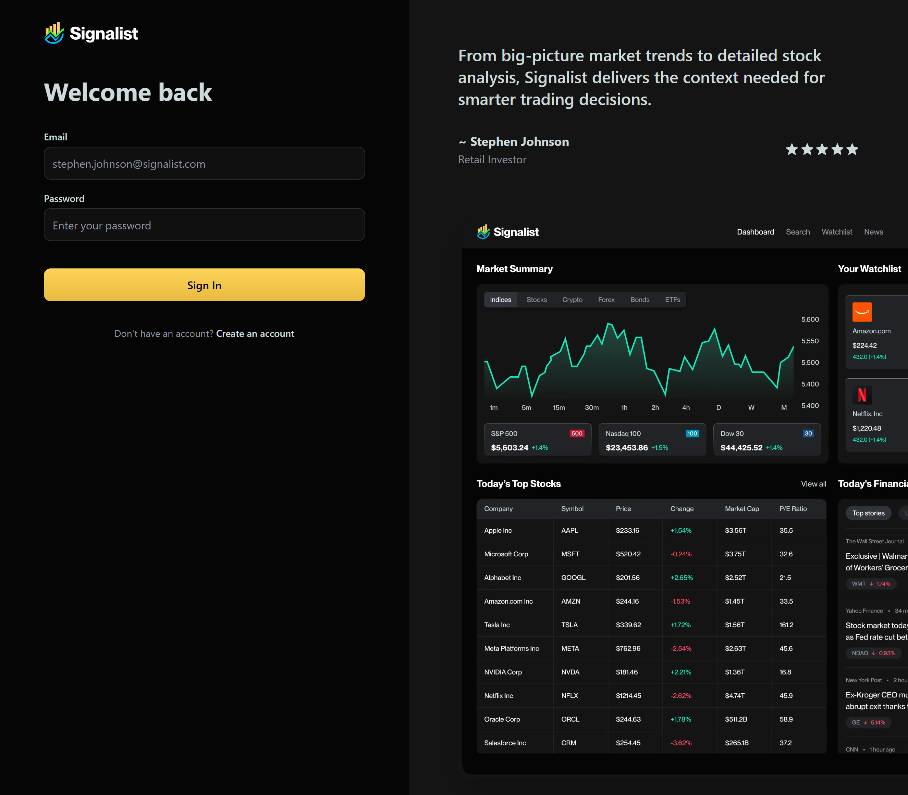
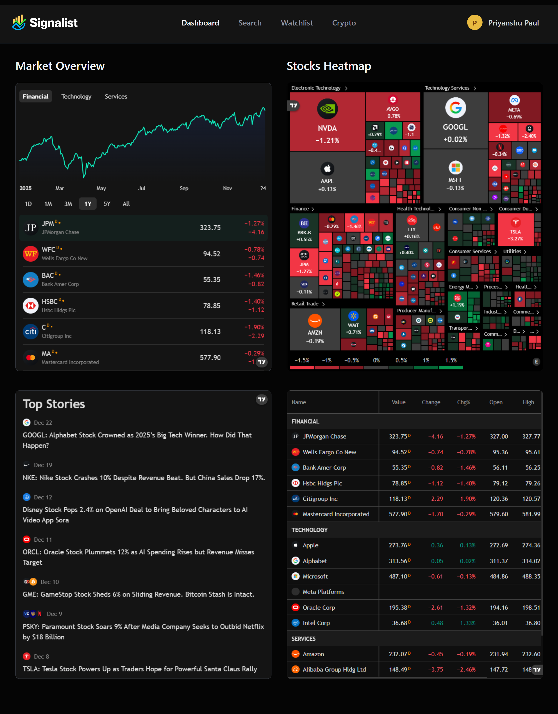
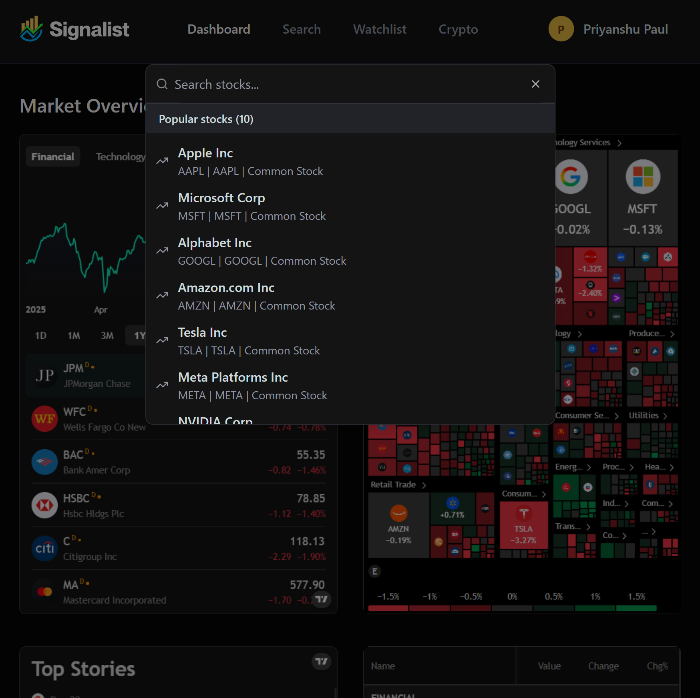
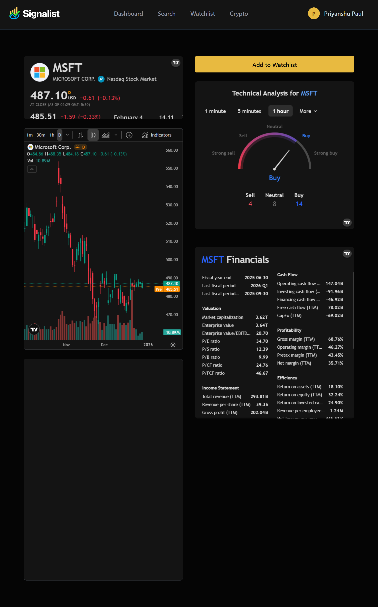
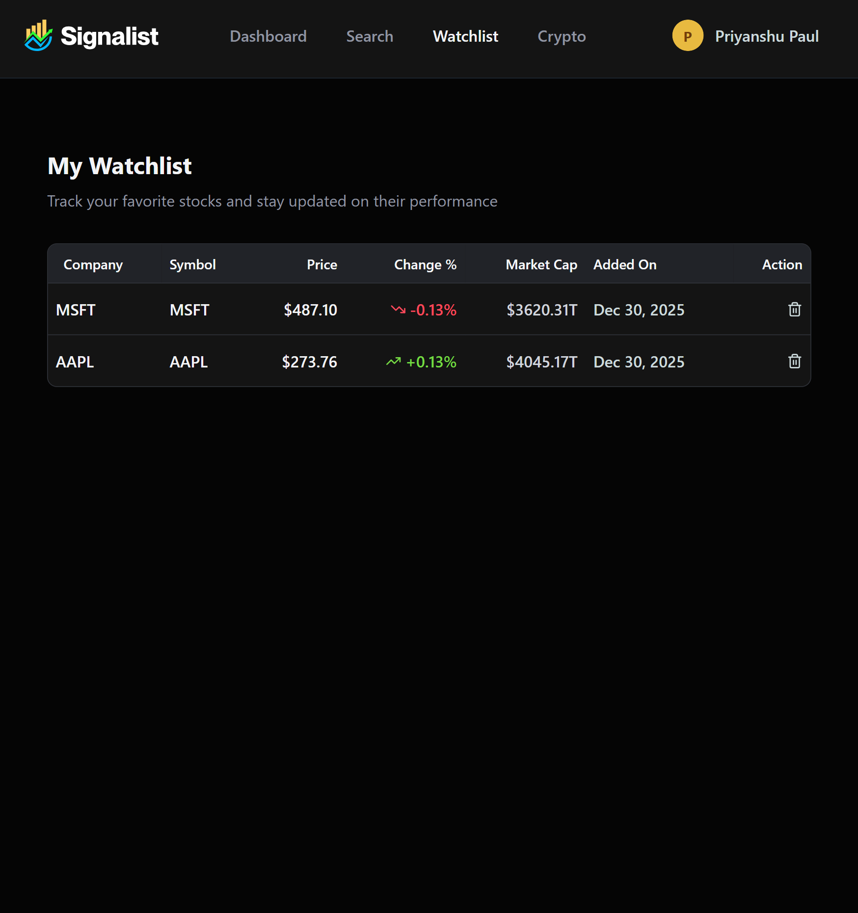
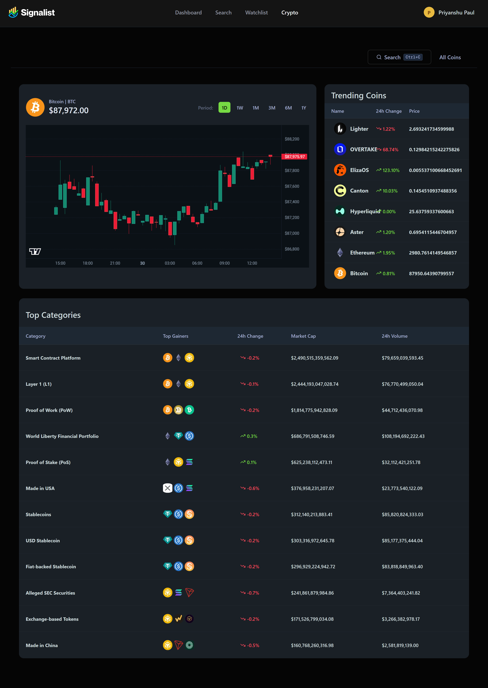

<div align="center">
  
  
  <h1>📈 Signalist</h1>
  <p><strong>Real-Time Market Intelligence for Stocks & Cryptocurrencies</strong></p>
  
  
  
  
  
  <p>
    <a href="#-application-overview">Overview</a> •
    <a href="#-getting-started">Getting Started</a> •
    <a href="#-dashboard">Dashboard</a> •
    <a href="#-global-search">Search</a> •
    <a href="#-stock-details--watchlist">Stock Details & Watchlist</a> •
    <a href="#-cryptocurrency-market">Crypto</a> •
    <a href="#️-tech-stack">Tech Stack</a> 
  </p>
</div>

---

## 📊 Application Overview

**Signalist** is a comprehensive real-time market intelligence platform for stocks and cryptocurrencies. Built with modern technologies including Next.js, Shadcn UI, Better Auth, and Inngest, Signalist empowers traders and investors with actionable insights through live price tracking, customizable alerts, advanced analytics, and automated workflows.

### Key Features

* **Real-time Market Data**: Live stock and crypto price tracking with sub-second updates
* **Smart Alerts**: Set custom price alerts and automated notifications via Inngest workflows
* **Advanced Charting**: Interactive charts with technical indicators and historical data visualization
* **Market Heatmaps**: Visual representation of market movements across sectors and assets
* **AI-Powered Predictions**: Buy/sell signal recommendations based on market analysis
* **Crypto Dashboard**: Comprehensive cryptocurrency tracking with price converters and exchange listings
* **Personalized Watchlists**: Organize and monitor your favorite assets in one place
* **Secure Authentication**: User management powered by Better Auth

Built for both casual investors and active traders seeking a unified platform for market analysis and portfolio management.

---

## 🚀 Getting Started

### For New Users

<table>
<tr>
<td width="50%">



</td>
<td width="50%">

#### Create Your Account

1. **Sign Up**: Navigate to the signup page and create your account with your email and password
2. **Personalize Your Experience**: Choose your investment preferences, favorite markets, and alert settings
3. **Automated Onboarding**: Upon registration, you'll receive a personalized welcome email tailored to your chosen options
4. **Smart Workflows**: Behind the scenes, Inngest workflows automatically fetch and curate content relevant to your interests
5. **Get Started**: You'll be guided through your personalized dashboard with recommendations based on your preferences

Our intelligent onboarding ensures you see the most relevant market data from day one.

</td>
</tr>
</table>

---

### For Existing Users

<table>
<tr>
<td width="50%">



</td>
<td width="50%">

#### Welcome Back

1. **Sign In**: Use your registered email and password to access your account
2. **Secure Authentication**: Powered by Better Auth for enterprise-grade security
3. **Instant Access**: Get redirected directly to your personalized dashboard
4. **Resume Tracking**: Your watchlists, alerts, and preferences are automatically loaded
5. **Real-Time Updates**: Start monitoring live market data immediately upon login

Your session is securely managed, keeping your financial data safe and private.

</td>
</tr>
</table>

---

## 📈 Dashboard

<div align="center">
  
</div>

Once you sign in or complete the onboarding process, you'll be redirected to your personalized dashboard—your command center for all market intelligence. The dashboard is designed to give you a comprehensive view of the markets at a glance, combining real-time data with intelligent visualization.

### Market Overview

The **Market Overview** section provides a bird's-eye view of major market indices and sectors. Track the performance of Financial, Technology, and Services sectors through interactive line charts that display historical trends and current movements. Below the chart, you'll find a curated list of major global indices including:

- **JPMorgan Chase** - Leading financial institution performance
- **Wells Fargo** - Banking sector insights
- **Bank of America Corp** - Major bank tracking
- **HSBC Holdings** - International banking perspective
- **Citigroup Inc** - Financial services monitoring
- **Mastercard Incorporated** - Payment processing trends

Each index displays real-time pricing with percentage changes and absolute value movements, color-coded for quick visual reference (red for losses, green for gains).

### Stocks Heatmap

The **Stocks Heatmap** offers a visual representation of market movements across different sectors and companies. This powerful tool allows you to:

- **Identify Trends**: Quickly spot which sectors are gaining or losing momentum
- **Compare Performance**: See relative performance across industries at a glance
- **Sector Analysis**: Toggle between Electronic Technology, Technology Services, Health Technology, Finance, Consumer Services, and more
- **Company-Level Detail**: Drill down to individual stocks like NVDA, GOOGL, META, AAPL, AMZN, and others

The heatmap uses color intensity to represent percentage changes—deeper red indicates larger losses, while deeper green shows stronger gains. Block size represents market capitalization or trading volume, giving you context on each stock's market significance.

### Top Stories

Stay informed with the **Top Stories** section, which aggregates the latest market-moving news:

- Real-time news updates from major financial publications
- Company-specific announcements and earnings reports
- Market analysis and expert commentary
- Sector-wide developments and regulatory changes

Recent stories include major events like "Google: Alphabet Stock Crowned as 2023's Big Tech Winner," "Nike Stock Crashes 10% Despite Revenue Beat," and AI-related market movements. Each story is timestamped and sourced, allowing you to track when information becomes available.

### Financial Tables

At the bottom of the dashboard, detailed **financial tables** break down market data by sector:

**Financial Sector**: Track major banks and financial institutions with columns for Value, Change (absolute and percentage), Open, and High prices.

**Technology Sector**: Monitor tech giants like Apple, Alphabet, Microsoft, Meta Platforms, Oracle Corp, and Intel Corp with comprehensive price data and daily movements.

All data updates in real-time, ensuring you're always working with the most current market information available.

---

## 🔍 Global Search

<div align="center">
  
</div>

Signalist features a powerful **Global Search** functionality that puts thousands of stocks at your fingertips. Access it instantly using the keyboard shortcut **Ctrl+K** (Windows/Linux) or **⌘K** (Mac) from anywhere in the application.

### Quick Access to Any Stock

The search modal provides:

- **Instant Search**: Type any company name or stock ticker to find relevant matches
- **Real-time Results**: Search results appear as you type, powered by the Finnhub API
- **Popular Stocks**: Always displays the top 10 most popular global stocks for quick access, including:
  - **Apple Inc** (AAPL) - Technology leader
  - **Microsoft Corp** (MSFT) - Software giant
  - **Alphabet Inc** (GOOGL) - Search and cloud services
  - **Amazon.com Inc** (AMZN) - E-commerce and cloud computing
  - **Tesla Inc** (TSLA) - Electric vehicle manufacturer
  - **Meta Platforms Inc** (META) - Social media conglomerate
  - **NVIDIA Corp** (NVDA) - Graphics and AI chips

### Comprehensive Stock Information

Each search result displays:

- Company full name and stock ticker symbol
- Stock type (Common Stock, Preferred Stock, etc.)
- Real-time trend indicators showing price direction
- Quick navigation to detailed stock pages

### Seamless Navigation

Simply click on any stock from the search results to be instantly redirected to its detailed view, where you can access:

- Live price charts and historical data
- Technical indicators and analysis
- Company fundamentals and news
- Add to watchlist functionality
- Set custom price alerts

The global search ensures you can track any publicly traded company worldwide, making Signalist your comprehensive market intelligence platform regardless of which stocks you're interested in.

---

## 📊 Stock Details & Watchlist

### Detailed Stock Analysis

<div align="center">
  
</div>

When you navigate to any stock from the global search or dashboard, you'll access a **comprehensive stock details page** that provides everything you need to make informed trading decisions.

**Live Price Chart**: The centerpiece features an interactive candlestick chart powered by **TradingView widgets**, offering professional-grade charting capabilities. Toggle between multiple timeframes (1 minute, 5 minutes, 30 minutes, 1 hour, 1 day) to analyze short-term movements or long-term trends. The chart includes volume indicators and technical overlays, with OHLC (Open, High, Low, Close) data displayed prominently. All real-time price data is sourced directly from the **Finnhub API**, ensuring accurate and up-to-the-second market information.

**Technical Analysis Gauge**: A visual sentiment meter provides instant buy/sell recommendations based on technical indicators. The gauge displays the current market sentiment with clear metrics showing the number of sell signals, neutral indicators, and buy signals, helping you understand market consensus at a glance.

**Financial Data**: Access comprehensive financial information including:
- **Cash Flow**: Operating, investing, and financing cash flows with TTM (Trailing Twelve Months) data
- **Valuation Metrics**: Market capitalization, enterprise value, P/E ratio, P/S ratio, P/B ratio, and P/CF ratio
- **Profitability**: Gross margin, operating margin, pretax margin, and net margin percentages
- **Efficiency Ratios**: Return on assets, return on equity, and return on invested capital
- **Income Statement**: Total revenue, revenue per share, and gross profit figures

All financial data is sourced in real-time from the **Finnhub API**, ensuring accuracy and reliability for your investment analysis. The integration of TradingView's industry-standard charting tools with Finnhub's comprehensive market data creates a powerful combination for technical and fundamental analysis.

---

### Personalized Watchlist

<div align="center">
  
</div>

**Add to Watchlist**: From any stock details page, simply click the "Add to Watchlist" button to save stocks you want to monitor closely. Your watchlist becomes your personalized portfolio tracking tool.

**AI-Powered Daily Insights**: Here's where Signalist truly shines—once you add stocks to your watchlist, our **Inngest-powered background workflows** automatically activate:

- **Daily Cron Jobs**: Every morning, automated workflows analyze your watchlisted stocks using real-time data from Finnhub
- **AI-Generated Insights**: Receive personalized email reports with AI-powered analysis of your favorite stocks
- **Market Movement Alerts**: Get notified of significant price changes, news, or technical signal shifts
- **Custom Analytics**: Insights are tailored to each stock's performance and your trading preferences

**Watchlist Management**: Your watchlist page displays all tracked stocks in an organized table format showing:
- Company name and ticker symbol
- Current price with real-time updates from Finnhub API
- Percentage change (color-coded: red for losses, green for gains)
- Market capitalization
- Date added to watchlist
- Quick delete action for easy management

The watchlist syncs across all your devices, ensuring you can monitor your favorite stocks whether you're on desktop or mobile. With Signalist's intelligent automation powered by Inngest workflows and real-time Finnhub data, you're always informed about the stocks that matter most to you—without having to constantly check the markets manually.

---

## 💰 Cryptocurrency Market

<div align="center">
  
</div>

Signalist extends beyond traditional stock markets to provide comprehensive **cryptocurrency tracking and analysis**. The dedicated crypto section offers real-time monitoring of digital assets across global exchanges.

**Key Features**:
- **Live Price Charts**: Interactive candlestick charts powered by TradingView widgets for Bitcoin, Ethereum, and thousands of altcoins
- **Trending Coins**: Track the hottest cryptocurrencies with 24-hour price changes and market movements
- **Top Categories**: Explore crypto by category including Smart Contract Platforms, Layer 1 protocols, DeFi tokens, stablecoins, and more
- **Market Data**: Access comprehensive metrics including market cap, 24-hour volume, price changes, and top gainers
- **Exchange Listings**: View where each cryptocurrency is traded across major exchanges
- **Coin Search**: Quickly find any cryptocurrency using the global search functionality
- **Real-time Updates**: All data powered by leading crypto data APIs for accurate, up-to-the-second information

Whether you're a Bitcoin maximalist, DeFi enthusiast, or exploring the broader crypto ecosystem, Signalist provides the tools you need to stay informed and make data-driven decisions in the fast-moving world of digital assets.

**Explore the crypto markets and discover your next investment opportunity!**

---

## ⚙️ Tech Stack

Signalist is built with cutting-edge technologies to deliver a fast, reliable, and scalable market intelligence platform.

### Core Framework & Language

<table>
<tr>
<td width="50%">

**Next.js**

A powerful React framework for building full-stack web applications. It provides server-side rendering, static site generation, and API routes, allowing developers to create optimized and scalable apps quickly.

</td>
<td width="50%">

**TypeScript**

A statically typed superset of JavaScript that improves code quality, tooling, and error detection. It is ideal for building large-scale applications and enhances maintainability.

</td>
</tr>
</table>

---

### Authentication & Database

<table>
<tr>
<td width="50%">

**Better Auth**

A framework-agnostic authentication and authorization library for TypeScript. It provides built-in support for email/password login, social sign-on (Google, GitHub, Apple, and more), and multi-factor authentication, simplifying user authentication and account management.

</td>
<td width="50%">

**MongoDB**

A flexible, high-performance NoSQL database. It stores data in JSON-like documents, supports dynamic schemas, and provides robust features for scalability, replication, and querying.

</td>
</tr>
</table>

---

### Market Data & Visualization

<table>
<tr>
<td width="50%">

**Finnhub API**

A real-time financial data API that provides stock, forex, and cryptocurrency market data. It offers developers access to fundamental data, economic indicators, and news, making it useful for building trading apps, dashboards, and financial analysis tools.

</td>
<td width="50%">

**CoinGecko API**

A comprehensive and reliable RESTful API that provides real-time and historical cryptocurrency market data, including prices, market capitalization, volume, and exchange information, enabling developers to build crypto tracking, analysis, and portfolio management applications.

</td>
</tr>
<tr>
<td colspan="2">

**TradingView Widgets**

A high-performance financial visualization library that provides interactive charting capabilities for rendering complex OHLCV data. It enables the integration of responsive candlestick charts and technical indicators, allowing users to perform professional-grade technical analysis with low-latency updates and surgical precision.

</td>
</tr>
</table>

---

### Workflow Automation & Notifications

<table>
<tr>
<td width="50%">

**Inngest**

A platform for event-driven workflows and background jobs. It allows developers to build reliable, scalable automated processes such as real-time alerts, notifications, and AI-powered workflows.

</td>
<td width="50%">

**Nodemailer**

A Node.js library for sending emails easily. It supports various transport methods such as SMTP, OAuth2, and third-party services, making it a reliable tool for handling transactional emails, notifications, and contact forms in applications.

</td>
</tr>
</table>

---

### UI & Styling

<table>
<tr>
<td width="50%">

**Shadcn UI**

An open-source library of fully customizable, accessible React components. It helps teams rapidly build consistent, visually appealing UIs while allowing full control over design and layout.

</td>
<td width="50%">

**TailwindCSS**

A utility-first CSS framework that allows developers to build custom, responsive designs quickly without leaving their HTML. It provides pre-defined classes for layout, typography, colors, and more.

</td>
</tr>
</table>

---

### Architecture Overview
```
┌─────────────────────────────────────────────────────────────┐
│                    Signalist Platform                        │
├─────────────────────────────────────────────────────────────┤
│  Frontend: Next.js + TypeScript + TailwindCSS + Shadcn UI   │
├─────────────────────────────────────────────────────────────┤
│  Authentication: Better Auth                                 │
├─────────────────────────────────────────────────────────────┤
│  Data Sources: Finnhub API + CoinGecko API                  │
│  Visualization: TradingView Widgets                          │
├─────────────────────────────────────────────────────────────┤
│  Automation: Inngest Workflows + Nodemailer                  │
├─────────────────────────────────────────────────────────────┤
│  Database: MongoDB                                           │
└─────────────────────────────────────────────────────────────┘
```

This powerful technology stack enables Signalist to deliver real-time market intelligence with enterprise-grade reliability, scalability, and performance.

---

## 📧 Contact

**Priyanshu Paul** - [LinkedIn](https://www.linkedin.com/in/priyanshu-paul-59221228a/)

Project Link: [https://signalist-tracker.vercel.app/](https://signalist-tracker.vercel.app/)

GitHub Repository: [https://github.com/priyanshu09102003/Signalist_Stock_Market_Application](https://github.com/priyanshu09102003/Signalist_Stock_Market_Application)

---

<div align="center">
  <p>Made with ❤️ by Priyanshu</p>
  <p>⭐ Star this repo if you find it helpful!</p>
</div>


